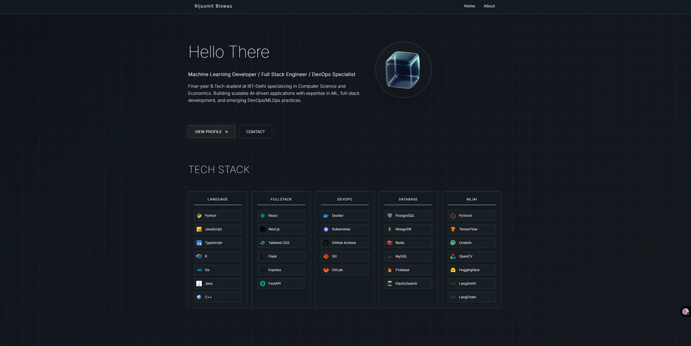

Portfolio Website

This is the personal portfolio website of **Rijusmit Biswas**, a Machine Learning and Full Stack Developer currently expanding into DevOps.

## 🖼️ Preview

## 🚀 Tech Stack

This portfolio is built using:

- **Next.js** with **App Router**
- **Tailwind CSS**
- **TypeScript**
- **Framer Motion**
- **React Icons**

## 📁 Folder Structure

- `src/app/` — Main application source (pages, components, styles)
- `public/` — Static assets
- `media/` — Contains `main.png`, a screenshot of the homepage

## 🌐 Deployment

The site builds to a fully static export (`output: "export"` in
`next.config.mjs`). `npm run build` writes it to `./out`, which can be
served by any static host. See [`DEPLOY.md`](./DEPLOY.md) for VPS/nginx
steps; a sample config lives in [`deploy/nginx.conf`](./deploy/nginx.conf).

## 🛠️ Features

- Responsive design
- Smooth animations
- Highlighted tech stack
- Featured project section (expandable)
- Contact buttons (Learn More / Get in Touch)

---

